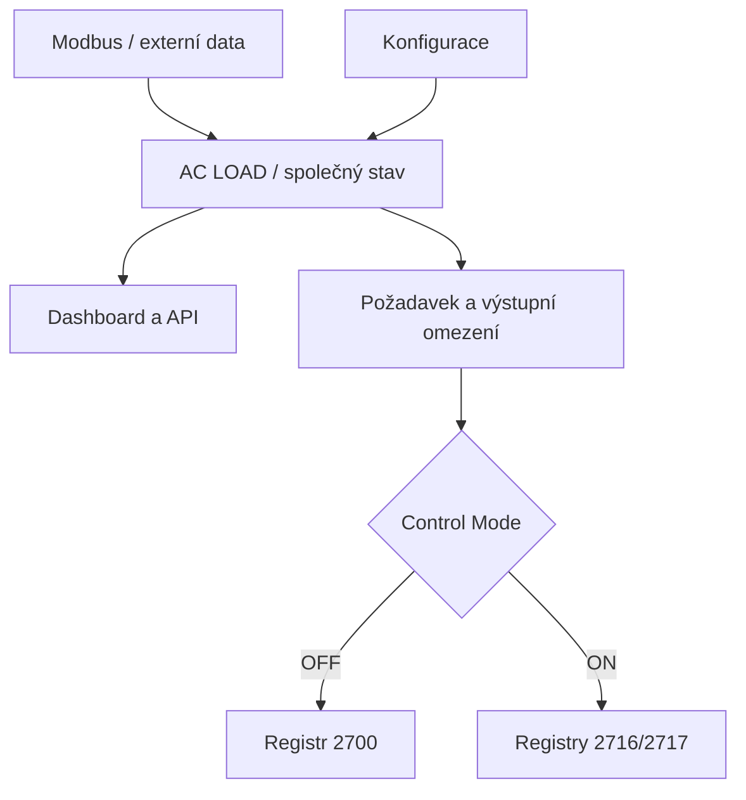

[🇨🇿 **Česky**](07_ARCHITEKTURA.md) | [🇬🇧 English](../en/07_ARCHITECTURE.md)

---

# Architektura LINEA

## Základní vrstvy

LINEA odděluje získání dat od rozhodování a samotného zápisu do FVE.



## Zdroje dat

LINEA pracuje zejména s těmito zdroji:

- Modbus TCP FVE/ESS;
- Grid Point;
- Victron VRM API;
- SPOT ceny;
- predikce výroby a spotřeby;
- čas a poloha instalace;
- Shelly/MQTT zařízení.

Zdroje se obnovují nezávisle. Referenční flow u některých vstupů používá uložené náhradní hodnoty nebo nulu; podrobnosti popisuje [tok dat](08_TOK_DAT.md).

## Normalizovaný stav

Řídicí logika používá společný stav obsahující aktuální hodnoty potřebné pro rozhodování. Patří sem zejména:

- FV výkon;
- AC spotřeba;
- Grid Point;
- SOC;
- stav baterie;
- SPOT cena;
- povolení přetoků;
- predikce;
- časová okna;
- uživatelská konfigurace.

## Rozhodovací vrstva

ESS algoritmus vyhodnocuje provozní stav a aktivní strategie. Jejich výsledkem je požadovaný Grid Point předávaný výstupnímu omezení a převodu pro Modbus. Rozsah této kontroly má [implementační omezení](12_MODBUS.md).

## Výstupní vrstva

Výsledný Grid Point je odeslán podle zvoleného režimu:

```text
Control Mode OFF → 2700
Control Mode ON  → 2716/2717
```

Registr 2700 používá zápis při změně. Registry 2716/2717 používají periodický heartbeat.

## Samostatné projekty

Daikin, UPS a externí chlazení nejsou součástí řídicího jádra. Integrace s LINEA má být realizována přes jasně definované vstupy a výstupy, aby bylo možné každý projekt používat nezávisle.

---

[← Dokumentace LINEA](README.md)
## LINEA API

Nad hotovým stavem LINEA je dostupná samostatná **read-only** integrační vrstva. API nezasahuje do řídicí logiky ani Modbus registrů; pouze publikuje existující stav pro klienty. Viz [LINEA API](api/PREHLED.md).
