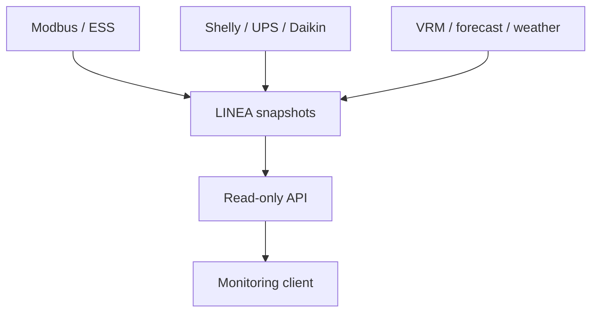

[🇨🇿 Česky](01_PREHLED_A_ARCHITEKTURA.md) | [🇬🇧 English](../../en/api/01_OVERVIEW_AND_ARCHITECTURE.md)

---

# Přehled a architektura

## Účel

API je malá read-only integrační vrstva nad existujícími LINEA globals a hotovými snapshoty. Prvním klientem bude Nextcloud LINEA Monitor & Analytics, ale stejné rozhraní může využít externí displej, Home Assistant, Grafana nebo jiné monitorovací řešení.



LINEA zůstává zdrojem aktuální pravdy a řídicí logiky. API nesmí znovu počítat ESS rozhodnutí, měnit registry, ovládat měniče, baterii ani jiná zařízení.

## Bezpečnostní princip

Endpointy jsou read-only, ale přístup musí chránit nasazení Node-RED/reverse proxy. Viz [zprovoznění a ochrana](02_ZPROVOZNENI_A_POUZITI.md). Veřejné modulové snapshoty mají být redukované; API builder je přebírá a nenahrazuje bezpečnostní filtr libovolného obsahu globals.


## Verze a kompatibilita

```text
API version: 1.0.0
schema:      1
path:        /api/v1/...
```

Klient se má při kompatibilitě orientovat především podle `schema`. Bugfix implementace může změnit `version` bez změny datového schématu. Nekompatibilní změna veřejné struktury vyžaduje zvýšení schema; nový API path má smysl až podle rozsahu skutečné změny.

Referenční flow publikuje API 1.0.0 se schema 1. Provozní omezení popisuje [stáří a dostupnost](05_KONVENCE_A_STARI_DAT.md).

---

[← LINEA API](PREHLED.md) · [← Hlavní dokumentace](../README.md)
