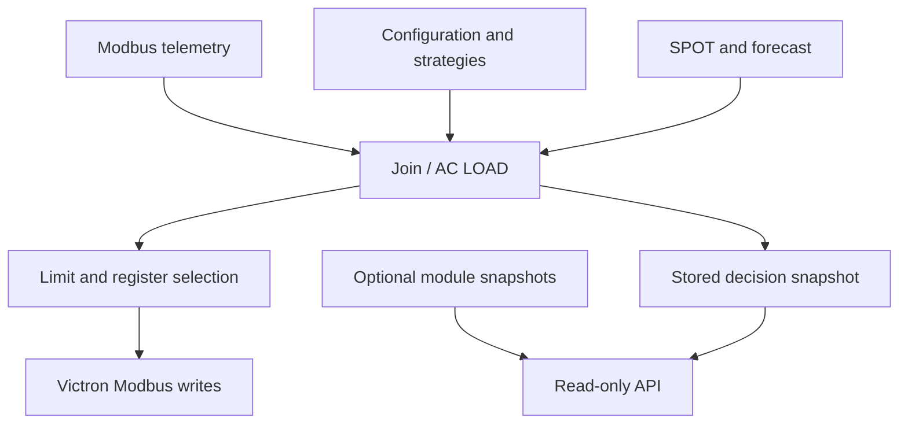

[Česky](../cz/07_ARCHITEKTURA.md) | [English](07_ARCHITECTURE.md)

# Architecture

LINEA combines local Modbus telemetry with SPOT prices, VRM/forecast data and user settings. CORE manages configuration, the Battery Control flow computes the requested grid setpoint, and Dashboard displays state and changes settings. Optional modules publish their own state.

The API reads completed state; it does not run a second ESS control algorithm. It is an HTTP interface inside the Node-RED installation, not a separate service that must be installed. Long-term history belongs to an external collector, such as the planned Nextcloud monitor.

The writer selects 2700 for Control Mode OFF and 2716/2717 for ON. Repeated values are suppressed only on the 2700 branch. Snapshot freshness is not proof of physical sensor freshness or successful control. See [data flow](08_DATA_FLOW.md), [Modbus](12_MODBUS.md) and [API](api/README.md).

[← Documentation](README.md)
