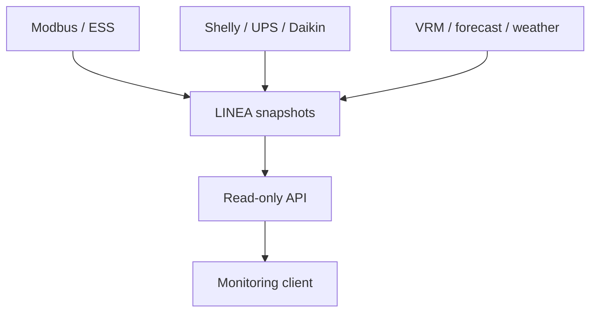

[🇨🇿 Česky](../../cz/api/01_PREHLED_A_ARCHITEKTURA.md) | [🇬🇧 English](01_OVERVIEW_AND_ARCHITECTURE.md)

---

# Overview and architecture

## Purpose

The API is a small read-only integration layer over existing LINEA globals and completed snapshots. The first client will be Nextcloud LINEA Monitor & Analytics, but the same interface may later be consumed by an external display, Home Assistant, Grafana or another monitoring solution.



LINEA remains the source of current truth and control logic. The API must not recalculate ESS decisions, change registers, or control inverters, the battery, or other devices.

## Security principle

Sensitive or unnecessarily internal data must not be exported, especially Daikin/VRM tokens, client secrets, internal IP addresses, Shelly MQTT IDs, unnecessary Modbus Unit IDs and unnecessary serial numbers. `api.readOnly` is explicitly `true`.

## Versioning and compatibility

```text
API version: 1.0.0
schema:      1
path:        /api/v1/...
```

Clients should primarily use `schema` for compatibility. An implementation bugfix may change `version` without changing the data schema. An incompatible public-structure change requires a schema increment; a new API path should only be considered when a real change justifies it.

The supplied flow exposes version 1.0.0, schema 1. This documentation review does not certify live production behavior.

---

[← LINEA API](README.md) · [← Main documentation](../README.md)

Deployment must protect these read-only endpoints. The builder passes through prepared module snapshots; it is not a sanitization layer for arbitrary globals. See [access setup](02_INSTALLATION.md) and [freshness limitations](05_CONVENTIONS_AND_FRESHNESS.md).
